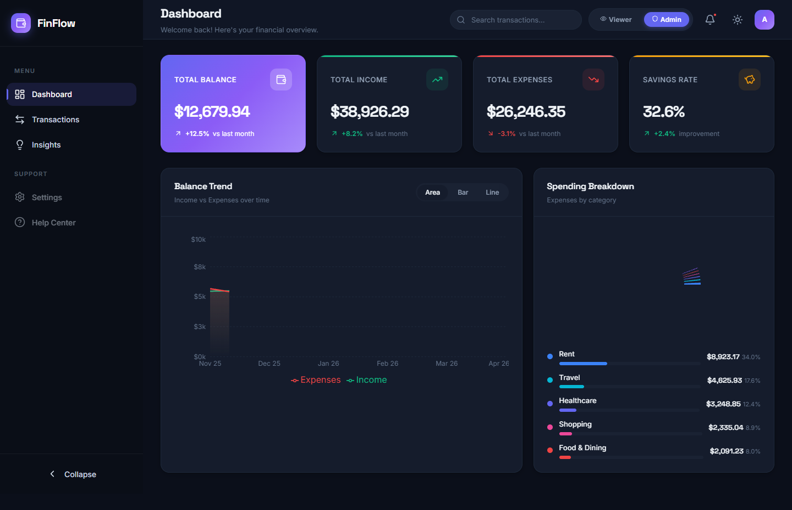
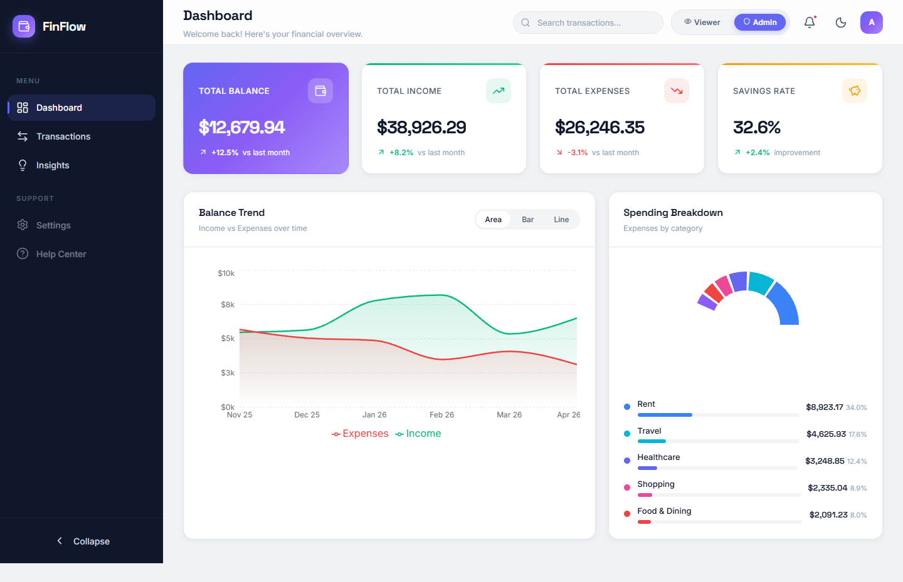
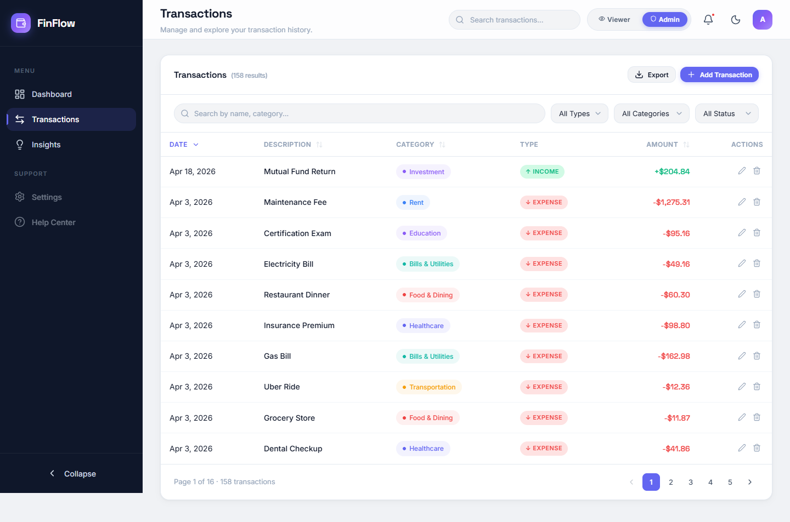
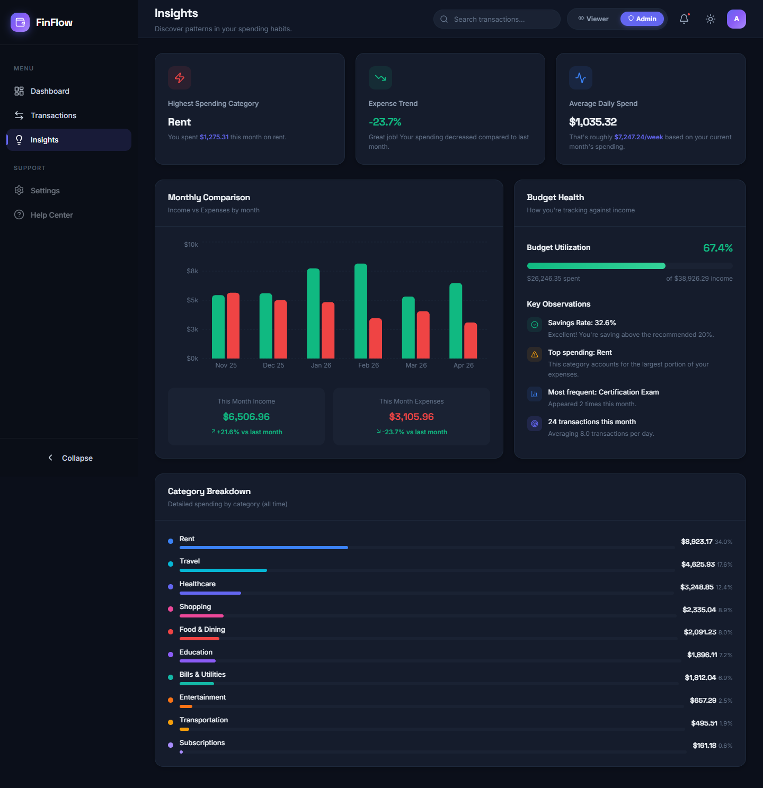

<div align="center">
  <h2>Finance Dashboard UI</h2>
  <p>Track your income, expenses, and personal savings securely and efficiently.</p>
</div>

---

<div align="center">
  
</div>

---

### 📝 Table of Contents
- [✨ Features](#-features)
- [📁 Folder Structure](#-folder-structure)
- [🚀 Getting Started](#-getting-started)
- [📷 Screenshots](#-screenshots)
- [⚙️ Tech Stack](#️-tech-stack)
- [📊 Stats](#-stats)
- [🏗️ State Management](#️-state-management)

---

## ✨ Features

- **Dashboard Overview**: Highly visual cards and dual-mode charts parsing real-time analytics.
- **Transactions Grid**: Deeply filterable and paginated arrays with built-in export triggers (`.csv` / `.json`).
- **Role-Based Access Control**: Simulated Admin vs. Viewer permissions controlling CRUD transaction logic.
- **Insights Engine**: Calculates complex budget behaviors, highlights categorical anomalies, and computes precise saving rates.

---

## 📁 Folder Structure

Here is the folder structure of this app.

```text
finance-dashboard/ 
|- scripts/ 
|-- capture.js
|- src/ 
|-- components/ 
|--- Charts.jsx
|--- Header.jsx
|--- InsightsPanel.jsx
|--- Sidebar.jsx
|--- SummaryCards.jsx
|--- Toasts.jsx
|--- TransactionModal.jsx
|--- TransactionsTable.jsx
|-- context/ 
|--- AppContext.jsx 
|-- data/ 
|--- mockData.js 
|-- App.jsx
|-- index.css
|-- main.jsx
|- index.html
|- vite.config.js
|- package.json
```

---

## 🚀 Getting Started

1. Make sure Git and NodeJS is installed.
2. Clone this repository to your local computer.
3. Create `.env.local` file in root directory.
4. Contents of `.env.local`:

```env
# .env.local

# disabled next.js telemetry
NEXT_TELEMETRY_DISABLED=1

# clerk auth keys
NEXT_PUBLIC_CLERK_PUBLISHABLE_KEY=pk_test_XXXXXXXXXXXXXXXXXXXXXXXXXXXXXXXXXXXXXXXXXXXXXXXXXXXXXXXXXXX
CLERK_PUBLISHABLE_KEY=pk_test_XXXXXXXXXXXXXXXXXXXXXXXXXXXXXXXXXXXXXXXXXXXXXXXX
CLERK_SECRET_KEY=sk_test_XXXXXXXXXXXXXXXXXXXXXXXXXXXXXXXXXXXXXXXXX

# clerk redirect url
NEXT_PUBLIC_CLERK_SIGN_IN_URL=/sign-in
NEXT_PUBLIC_CLERK_SIGN_UP_URL=/sign-up

# neon db url
DATABASE_URL=postgresql://<username>:<password>@<hostname>/<database>?sslmode=require

# app base url
NEXT_PUBLIC_APP_URL=http://localhost:3000
```

Obtain Clerk Authentication Keys

Source: Clerk Dashboard or Settings Page
Procedure:
1. Log in to your Clerk account.
2. Navigate to the dashboard or settings page.
3. Look for the section related to authentication keys.
4. Copy the `NEXT_PUBLIC_CLERK_PUBLISHABLE_KEY` and `CLERK_SECRET_KEY` provided in that section.

Retrieve Neon Database URI

Source: Database Provider (e.g., Neon, PostgreSQL)
Procedure:
1. Access your database provider's platform or configuration.
2. Locate the database connection details.
3. Replace `<username>`, `<password>`, `<hostname>`, and `<database>` placeholders in the URI with your actual database credentials.
4. Ensure to include `?sslmode=require` at the end of the URI for SSL mode requirement.

Specify Public App URL

Procedure:
1. Replace `http://localhost:3000` with the URL of your deployed application.

Save and Secure:

Save the changes to the `.env.local` file.
Install Project Dependencies using `npm install --legacy-peer-deps` or `yarn install --legacy-peer-deps`.

Migrate database:

In terminal, run `npm run db:generate` to generate database client and `npm run db:migrate` to make sure that your database is up-to-date along with schema.

Run the Seed Script:

In the same terminal, run the following command to execute the seed script:
```bash
npm run db:seed
```
This command uses npm to execute the Typescript file (scripts/seed.ts) and writes transaction data in database.

Verify Data in Database:

Once the script completes, check your database to ensure that the transaction data has been successfully seeded.
Now app is fully configured 👍 and you can start using this app using either one of `npm run dev` or `yarn dev`.

**NOTE:** Please make sure to keep your API keys and configuration values secure and do not expose them publicly.

---

## 📷 Screenshots

### Dashboard — Dark Mode


### Transactions Hub (Dark Mode)


### Insights & Analytics (Light Mode)


---

## ⚙️ Tech Stack

This project was built utilizing un-bloated modern web technologies:

- **Frontend Framework**: [React.js](https://react.dev/) (via [Vite](https://vitejs.dev/))
- **Styling**: Vanilla CSS (`index.css` via custom Glassmorphism and CSS variables).
- **Icons**: [Lucide React](https://lucide.dev/)
- **Charts**: [Recharts](https://recharts.org/)
- **Animations**: `react-countup` and Custom CSS Keyframes.
- **State Management**: Native React `useContext` mapped directly to browser `localStorage` persistence.

---

## 📊 Stats


 


---

## 🏗️ State Management

- **Vanilla Architecting:** Built exclusively using the native **React Context API combined with `useReducer`** (`AppContext.jsx`) to showcase deep scalable competency without needing Redux or Zustand.
- **Data Persistence:** Integrated an active sync hook ensuring all state changes are constantly written downstream to browser `localStorage`, persisting user settings unconditionally between reloads.
